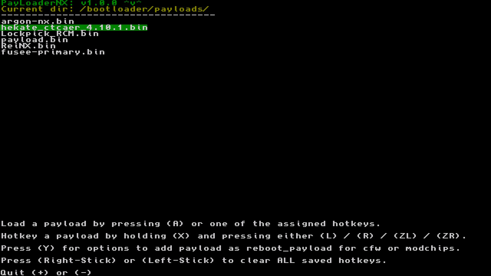

# PayloaderNX
Reboot your switch into any payload!

Works on Atmosphere as well as ReiNX and sxos.

### How to install
1. Extract the zip file to your sd card (so that payloadernx folder is inside /switch/).
2. Have the payloads ready on your switch sd card.
3. The default paths are: (NOTE: You can also set your own path in the app).
 - (root of the sd card)
 - payloads/
 - argon/payloads/
 - bootloader/payloads/
 - switch/payloadernx/payloads/

### How to install applet override
1. Create a folder with the name of the title ID of the applet (https://switchbrew.org/wiki/Title_list).
2. Add the exefs.nsp to that folder.
3. Add that folder to the titles folder of your cfw.
 - Atmosphere/titles/
 - ReiNX/titles/
 - sxos/titles/

### Credits

Fork of [Payload_Launcher](https://github.com/suchmememanyskill/Payload_Launcher).
Uses part of the atmosphere code from [the atmosphere repo](https://github.com/Atmosphere-NX/Atmosphere/blob/master/troposphere/reboot_to_payload/source/main.c). Licence of the atmosphere repo is included as AMS_LICENCE.
For the applet, it uses the code from [nx-hbloader](https://github.com/switchbrew/nx-hbloader) with the paths modified.
